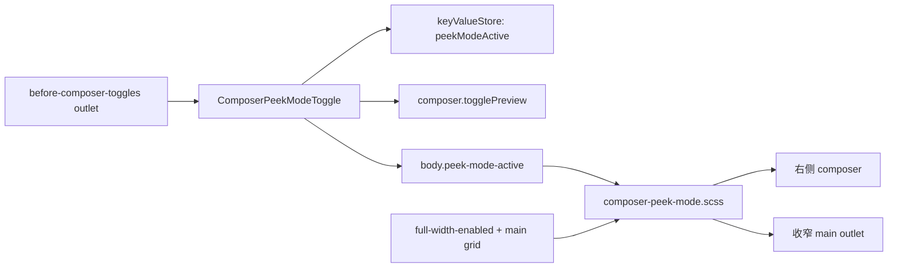

# Side Composer 实施方案

> 状态：proposed（供实现者执行，尚未开始编码）  
> 目标仓库：`LESP-book/side-composer`  
> 目标形态：Discourse Theme Component  
> 审阅基线：本地 Discourse `f7c85e6089cac8318e76bb0c58e8e3e898152a0f`

## 0. 结论

不要从零重写，也不要把 Horizon 的整套主题样式搬进来。

实施时采用两条上游：

1. **仓库骨架与依赖处理基线**：官方独立组件 [`discourse/composer-peek`](https://github.com/discourse/composer-peek)。
2. **实际行为与样式来源**：Discourse core 中最新 Horizon 的 composer peek 实现，而不是 `composer-peek` 当前较旧的 JS/SCSS。

本次研究快照：

| 上游 | 已审阅 commit |
|---|---|
| `discourse/discourse`（含 Horizon） | `f7c85e6089cac8318e76bb0c58e8e3e898152a0f` |
| `discourse/composer-peek` | `1f8283b` |
| `discourse/discourse-full-width-component` | `c371e57` |

最终组件只拥有三项职责：

- 在 composer 控制区注册“侧边模式”按钮；
- 持久化用户偏好，并协调 Discourse 原生 preview 开关；
- 在满足条件时，通过一个集中式 SCSS 模块把 composer 停靠到右侧并给正文腾出空间。

它**显式依赖** [`discourse-full-width-component`](https://github.com/discourse/discourse-full-width-component)。不复制 full-width 的网格、header、logo 等布局代码，不修改 Discourse core。

## 1. 研究结论与来源

### 1.1 官方已有独立抽取

`discourse/composer-peek` 已经是一个独立 Theme Component，并且提供了：

- `before-composer-toggles` outlet 注册；
- peek toggle 组件；
- peek 布局 SCSS；
- 缺少 full-width 时仅向 staff 展示的告警；
- Theme Component 元数据和兼容性骨架。

因此当前仓库应以它为起点，而不是重新设计一套扩展机制。

### 1.2 独立仓库实现落后于 Horizon 主线

不能原样复制 `discourse/composer-peek` 当前代码。Horizon 主线已包含这些关键更新：

| 项目 | 旧独立仓库 | 应采用的 Horizon 实现 |
|---|---|---|
| 偏好存储 | 裸 `localStorage` | `keyValueStore` service |
| body class | 只看用户偏好 | `peekModeActive && !composer.isPreviewVisible` |
| Button import | `discourse/components/d-button` | `discourse/ui-kit/d-button` |
| 无障碍标题 | 无 | `@title="composer.peek_mode_toggle"` |
| 响应式条件 | 硬编码 `1300px` | `@use "lib/viewport"` + `viewport.from(xl)`（当前为 80rem） |
| composer 尺寸 | 旧的 `100vh` / 固定宽度规则 | 使用 header offset、main grid gap、keyboard-visible 修复后的规则 |
| 新 composer UI | 旧 padding 调整 | `.reply-area { height: 100%; }` |

特别要保留 2026 年 Horizon 主线里的修复：

- preview 打开时临时移除 `peek-mode-active`，避免正文仍被压窄；
- iPad/13 英寸设备的软件键盘定位兼容；
- `height: unset` 只作用于真正的 peek 状态，避免破坏普通 composer 拖动调整高度；
- 新 composer redesign 下让 `.reply-area` 撑满侧栏高度。

### 1.3 full-width 是架构依赖，不只是视觉依赖

peek SCSS 依赖以下协议：

- `body.full-width-enabled`；
- `#main-outlet-wrapper` 的多列 grid；
- `.has-sidebar-page`；
- full-width 对 sidebar、main outlet 和 composer 的定位约束；
- Horizon 自己的 `--main-grid-gap` 间距变量（抽离后必须提供 CSS fallback）。

前四项由 `discourse-full-width-component` / Discourse core 提供。间距变量不属于 Full Width，所以本组件只在使用处写 fallback。Side Composer 不应成为第二个页面布局所有者。

### 1.4 与 Discourse core 的兼容协议

以下类名/DOM selector 虽然脆弱，但必须保留，因为 core 和 chat 已认识它们：

- `body.peek-mode-active`；
- `#reply-control.hide-preview`；
- `html.composer-open` / `html.fullscreen-composer`；
- `body.has-sidebar-page`；
- `body.keyboard-visible`；
- `.sidebar-wrapper .sidebar-container`。

不要把 `peek-mode-active` 重命名为项目自定义名字。当前 Discourse core 的 iPad composer 修复和 chat drawer 布局会读取该 class。

## 2. 范围

### 2.1 要做

- 在桌面宽屏 composer 顶部控制区显示切换按钮；
- 点击后关闭 Markdown preview，并将 composer 停靠到右侧；
- 同时收窄 main outlet，使正文与 composer 并排且不互相遮挡；
- 再次点击恢复普通底部 composer；
- 用户偏好跨页面导航、刷新保持；
- 用户从原生 preview 按钮打开 preview 时，临时退出侧边布局；关闭 preview 后自动恢复用户已保存的侧边偏好；
- 兼容 sidebar 显示/隐藏、fullscreen、窄屏、iPad 键盘状态和当前 composer redesign；
- 缺少 full-width 时，不启用功能，并给 staff 显示依赖告警；
- 提供系统测试、lint/format 配置和安装说明。

### 2.2 明确不做

- 不修改 `composer-container`、composer service 或任何 Discourse core 文件；
- 不复制 full-width 的整套页面/header/sidebar 布局；
- 不自建 editor、preview、draft 或路由状态；
- 不在 v1 提供可拖动横向分隔条；
- 不在 v1 提供左右停靠、宽度百分比、断点等设置项；
- 不支持手机上的侧边布局；
- 不保证与任意高度定制、重写 `#main-outlet-wrapper` 的第三方主题兼容；
- 不应与 Horizon 同时启用，因为 Horizon 已内置同一按钮和 class 协议，会产生重复控件。

## 3. 架构



### 3.1 API initializer

只做一件事：

```text
api.renderInOutlet("before-composer-toggles", ComposerPeekModeToggle)
```

不要在 initializer 内管理状态、查尺寸或直接改 DOM 样式。

### 3.2 Toggle component

组件只拥有一个持久偏好：`peekModeActive`。

状态契约：

| 持久偏好 | `composer.isPreviewVisible` | 实际侧边布局 |
|---|---:|---:|
| false | false/true | false |
| true | false | true |
| true | true | false（临时退出，偏好不丢失） |

实现要求：

- 注入 `composer` 和 `keyValueStore`；
- 初始化：`keyValueStore.getItem("peekModeActive") === "true"`；
- body class getter：仅当偏好为 true 且 preview 不可见时返回 `peek-mode-active`；
- 点击：反转偏好、写入 keyValueStore；若 `composer.showPreview` 为 true，则调用原生 `composer.togglePreview()`；
- 使用 `bodyClass` helper 管理 class 生命周期，不手工 `document.body.classList`；
- 使用 `discourse/ui-kit/d-button`；
- 图标保持 `discourse-sidebar`，标题使用 core 翻译键 `composer.peek_mode_toggle`。

这里必须区分：

- `showPreview`：用户的 preview 开关值，点击侧边按钮时用来决定是否关闭 preview；
- `isPreviewVisible`：结合 `allowPreview` 后的实际可见状态，用来决定 body class。

不要把 composer 的其他状态复制到本地 tracked 字段。

### 3.3 SCSS

所有 peek 布局规则集中到 `scss/composer-peek-mode.scss`。`common/common.scss` 只导入该模块。

采用当前 Horizon 主线规则，约束如下：

- 默认隐藏 `.peek-mode-toggle`；
- 仅在 `viewport.from(xl)`、非 fullscreen、composer open、full-width enabled 时显示按钮和启用布局；
- `.full-width-enabled.peek-mode-active` 下才改 composer 与 grid；
- composer 使用 `top: var(--header-offset)`；右侧和底部间距采用 `var(--main-grid-gap, 0.5em)`；
- 这里的 fallback 是从 Horizon 抽离时唯一必要的布局适配：`--main-grid-gap` 由 Horizon 自己定义，官方 Full Width 当前并不定义它；不得因此复制 Horizon `main.scss`；
- sidebar 打开时 composer 最大宽度为 `34vw`，main grid 预留 `35.5vw`，给正文保留更多空间；
- sidebar 关闭时 composer 最大宽度为 `40vw`，main grid 预留 `42vw`，使用对应 grid 公式；
- 中间 grid track 使用 `minmax(0, ...)`，并以容器 `100%` 和两侧 gap 计算可用宽度，避免 `100vw`（含滚动条）造成水平溢出；sidebar track 保持 `var(--d-sidebar-width)` 不被压缩；
- peek 状态隐藏纵向 resize grippie；
- `.reply-area` 高度撑满；
- 仅在 `:not(.keyboard-visible)` 时将 peek composer 的 `height` 设为 `unset`；
- 不为普通 `.hide-preview` composer 设置 `height: unset`；
- 不把 Horizon 的颜色、圆角、背景等品牌样式整体搬过来。只保留实现并排布局所需样式。

> 注意：Horizon 自身定义了 `--main-grid-gap`，官方 Full Width 当前不定义它。因此实现中必须直接使用 CSS fallback `var(--main-grid-gap, 0.5em)`。不要全局声明该变量，也不要复制 Horizon `main.scss`。

### 3.4 full-width 依赖告警

沿用官方 `composer-peek` 的 staff warning 思路：

- 在 `below-site-header` 注册轻量告警组件；
- 当前用户是 staff 且页面不存在 `.full-width-enabled` 时显示；
- 普通用户不显示；
- 告警链接指向官方 `discourse-full-width-component`；
- 功能按钮本身因 SCSS 的 `.full-width-enabled` gate 保持隐藏。

此告警只负责说明依赖，不负责动态安装、模拟或注入 full-width。

## 4. 预期仓库结构

```text
.
├── about.json
├── LICENSE
├── README.md
├── common/
│   └── common.scss
├── scss/
│   └── composer-peek-mode.scss
├── javascripts/discourse/
│   ├── api-initializers/
│   │   ├── composer-peek-toggle-connector.js
│   │   └── full-width-requirement.gjs
│   └── components/
│       └── composer-peek-mode-toggle.gjs
├── locales/
│   └── en.yml
├── spec/system/
│   ├── composer_peek_spec.rb
│   └── core_features_spec.rb
├── .github/workflows/
│   ├── discourse-theme.yml
│   └── d-compat-branch.yml
├── eslint.config.mjs
├── package.json
├── pnpm-lock.yaml
├── stylelint.config.mjs
├── .prettierrc.cjs
├── .template-lintrc.cjs
├── .rubocop.yml
├── .streerc
└── tsconfig.json
```

说明：

- 骨架文件优先同步官方 `composer-peek` / 当前 Discourse Theme Component skeleton；
- 不需要 `settings.yml`，除非工具链要求空文件；v1 没有用户设置；
- `about.json` 必须包含 `"component": true`；
- 保留 MIT license，并在 README 写明代码来源与上游链接。

## 5. 实施顺序

### 阶段 A：建立可安装骨架

1. 从官方 `discourse/composer-peek` 同步 Theme Component 骨架、元数据、license、CI/lint 配置和 core-features spec。
2. 更新名称、作者、仓库 URL、README；记录两个上游及同步时使用的 commit。
3. 安装依赖并跑一次 formatter/lint，确保空骨架可被 Discourse theme 工具识别。

退出信号：组件可上传/安装，core-features spec 与静态检查通过。

### 阶段 B：移植最新 Horizon 状态逻辑

1. 注册 `before-composer-toggles` outlet。
2. 移植当前 Horizon `ComposerPeekModeToggle`，不要使用独立仓库旧组件。
3. 保留 `peekModeActive` 存储 key，兼容已有用户偏好。
4. 添加按钮 title，验证 tooltip 与键盘/读屏名称。

退出信号：按钮能改变持久偏好；状态真值表全部成立。

### 阶段 C：移植最新 Horizon 布局规则

1. 建立单一 SCSS 模块；使用 viewport mixin。
2. 移植 current Horizon 的 sidebar/no-sidebar、header offset、grid gap、keyboard-visible 和 composer-redesign 规则。
3. 删除纯 Horizon 品牌样式，只保留布局必要项。
4. 验证普通底部 composer 的 resize 不受影响。

退出信号：宽屏下正文与 composer 并排；退出 peek、fullscreen、窄屏时回到 core 默认布局。

### 阶段 D：依赖保护与文档

1. 移植 full-width staff warning。
2. README 写清安装顺序：先 full-width，再 side-composer。
3. README 明确不得与 Horizon 同时启用，并列出支持范围与已知兼容边界。

退出信号：缺依赖时 staff 能看到可操作告警，普通用户不见按钮或告警。

### 阶段 E：测试与发布

1. 补齐系统测试矩阵；
2. 在 Foundation + Full Width 上做亮/暗色人工回归；
3. 在最新 stable 与 latest 两条 Discourse 版本线上验证；
4. 打首个 tag/release，并记录所同步的 Horizon core commit。

退出信号：自动化测试、lint、人工验收全部通过。

## 6. 测试方案

### 6.1 自动化系统测试（必须）

1. **开关与持久化**
   - 宽屏打开 composer；
   - 点击 peek 按钮后出现 `body.peek-mode-active`；
   - 导航或刷新后仍生效；
   - 再点一次后 class 消失且刷新后保持关闭。

2. **preview 协调**
   - composer 初始 preview 可见；
   - 开启 peek 后 preview 被关闭且侧边布局生效；
   - 点击 core preview 按钮重新打开 preview，`peek-mode-active` 消失；
   - 再次关闭 preview，`peek-mode-active` 自动恢复。

3. **窄屏**
   - viewport 小于 `xl` 时 peek 按钮不可见；
   - composer 保持 core 默认底部布局。

4. **fullscreen**
   - 进入 fullscreen 后 peek 按钮不可见，右侧停靠规则不生效；
   - 退出 fullscreen 后按已保存偏好恢复。

5. **sidebar 两种布局**
   - `.has-sidebar-page` 存在与不存在时分别开启 peek；
   - 两种情况下 composer 都靠右，main outlet 与 composer 的 bounding rect 不重叠；
   - sidebar 切换后布局重新计算且无水平溢出。

6. **full-width 缺失**
   - staff：看到依赖告警，peek 按钮不可见；
   - 非 staff：不显示告警，peek 按钮不可见。

7. **普通 composer resize 回归**
   - peek 未启用且 preview 隐藏时，拖动 grippie 能改变 composer 高度；
   - 防止 `height: unset` selector 泄漏到普通状态。

8. **core features smoke test**
   - 使用官方 shared example：`having working core features`。

测试环境必须明确区分两套 fixture：正常场景加载 Side Composer + Full Width（或等价测试 fixture，真实提供 class 与 grid）；缺依赖场景只加载 Side Composer。不要在所有测试里无条件手工给 body 加 class，否则依赖告警和真实集成没有被验证。

### 6.2 人工回归矩阵（发布前）

- Foundation + Full Width：sidebar 开/关；
- 亮色/暗色；
- Markdown editor 与 rich-text editor；
- 新建主题、回复、编辑帖子、私信 composer；
- 1280px 边界附近、常见 1366px、1440px、宽屏；
- iPad Pro 13 英寸横屏，软件键盘显示/隐藏；
- chat drawer 打开时的层级和定位；
- composer redesign 开/关（目标 Discourse 版本若仍保留该开关）；
- LTR；RTL 至少做一次冒烟测试并把“仍固定右侧”记录为当前行为。

## 7. 验收契约

- 安装 Full Width + Side Composer，使用非 Horizon 主题，在宽度 `>= xl` 打开 composer：出现带本地化 tooltip 的侧边模式按钮。
- 点击按钮：preview 关闭，composer 完整停靠右侧，正文区域收窄，二者无重叠、无水平滚动条。
- sidebar 显示和隐藏两种状态均满足上一条。
- 刷新或切换 topic 后，用户选择保持。
- 原生 preview 打开时恢复普通 composer 和普通正文宽度；关闭 preview 后恢复侧边模式。
- fullscreen 或 `< xl` 时不出现侧边停靠效果。
- 未安装 Full Width 时不出现可用按钮；staff 看见依赖说明，普通用户不看见该管理告警。
- 侧边模式未启用时，Discourse 原生 composer 的展开、收起、fullscreen、preview、拖动高度、保存草稿行为不变。
- 卸载 Side Composer 后，不需要改动 Discourse core 或 Full Width；除无害的 keyValueStore 偏好值外，功能完全消失。

## 8. 兼容性与风险

### 8.1 DOM/CSS 强耦合

该功能不可避免地依赖 core DOM class。风险集中在单个 SCSS 文件，Discourse 更新后优先检查：

- composer root id/class；
- main outlet grid；
- sidebar body class；
- fullscreen 与 keyboard body/html class；
- composer control outlet 是否仍存在。

### 8.2 两个上游会继续漂移

README 中维护一张同步记录：

```text
composer-peek baseline: <commit>
Horizon behavior source: <discourse commit>
last reviewed: <date>
```

每次升级 Discourse 时，对比：

```text
themes/horizon/javascripts/discourse/components/composer-peek-mode-toggle.gjs
themes/horizon/scss/composer-peek-mode.scss
themes/horizon/spec/system/composer_peek_spec.rb
```

同时查看 core 中 `peek-mode-active` 的引用，尤其是 `compose.scss` 和 chat plugin。

### 8.3 版本策略

`main` 只面向当前受支持的 Discourse latest/stable，不在同一份代码里堆旧 API 分支。需要支持旧版本时使用官方推荐的 `d-compat/YYYY.M` 分支；不要在初版伪造 `.discourse-compatibility` commit pin。

### 8.4 Horizon 重复安装

Horizon 已自带该功能。README 必须明确：此组件面向 Foundation/其他兼容主题，不应叠加到 Horizon。v1 不增加脆弱的“主题名检测”逻辑。

## 9. 给实现者的硬约束

- 以官方 `composer-peek` 为基线，但 JS/SCSS 行为必须移植当前 Horizon，不可照抄旧实现。
- 不修改 `/home/kuma/discourse_dev/discourse`；该目录只用于读取上游和运行集成测试。
- 不修改 Discourse composer service/component，不 monkey patch。
- 不复制 full-width 布局实现。
- 不重命名 `peek-mode-active` 或 `peekModeActive`。
- 不把尺寸监听、路由监听、preview 状态复制进 toggle 组件。
- 所有 peek 布局 selector 留在一个 SCSS 模块。
- 完成后必须提交测试输出、人工回归结果、上游 commit 记录和已知风险。

## 10. 关键参考

- 官方独立组件：https://github.com/discourse/composer-peek
- Full Width 依赖：https://github.com/discourse/discourse-full-width-component
- Horizon 上游：https://github.com/discourse/discourse/tree/main/themes/horizon
- 当前关键源文件：
  - `themes/horizon/javascripts/discourse/components/composer-peek-mode-toggle.gjs`
  - `themes/horizon/javascripts/discourse/api-initializers/composer-peek-toggle-connector.js`
  - `themes/horizon/scss/composer-peek-mode.scss`
  - `themes/horizon/spec/system/composer_peek_spec.rb`
  - `app/assets/stylesheets/common/base/compose.scss`
  - `plugins/chat/assets/javascripts/discourse/components/chat-drawer.gjs`
  - `plugins/chat/assets/stylesheets/common/chat-drawer.scss`
